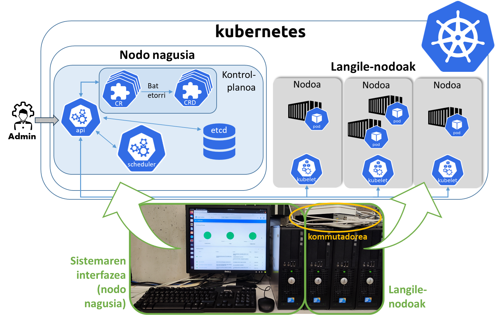
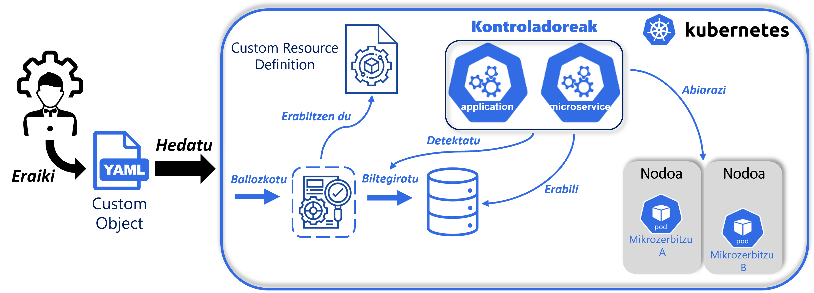

# Software-plataforma

MAL honek Fog aplikazioen operazio edo inplementaziorako software-plataforma bezala [Kubernetes](https://kubernetes.io/) proposatzen du. Kubernetes Docker edukiontziak kudeatzeko plataformarik ezagunena da. Honen egitura aurkezteko, hurrengo irudia garatu da:



## Kubernetes hedagarria

Proiektu honetan ez da defektuzko Kubernetes plataforma erabili. Plataformari hedagarri bat gehitu zaio, proposatzen den ikuspegia aurrera eramateko. Plataformaren hedapenerako aplikazio eta mikrozerbitzu mailak integratu dira, Fog aplikazioa eta osatzen dituzten mikrozerbitzuen kudeaketak garatuko dituztenak. Proposatzen den plataforman Fog aplikazio bat abiarazteko prozesua hurrengo irudian aurkeztu da: 



## Karpetaren antolakuntza

Atal honetan software-plataformarako garatu diren fitxategien antolakuntza aurkeztuko da:

- [appModel2CR](https://github.com/ekhurtado/EkaitzHurtado-MAL/tree/main/Kodea/Software_plataforma/appModel2CR): Karpeta honek sistemaren administratzaileak Kubernetes hedagarrirako hedatzeko-fitxategiak lortzeko programa gordetzen du.
  - [appModelTransformer.py](https://github.com/ekhurtado/EkaitzHurtado-MAL/blob/main/Kodea/Software_plataforma/appModel2CR/appModelTransformer.py): Programa honek XMLen garatutako aplikazio-eredu bat erabiliz, proiektu honetan proposatzen den Kubernetes hedagarrian abiarazi daitekeen hedatze-fitxategia sortzen du, hau da, [CR](https://kubernetes.io/docs/concepts/extend-kubernetes/api-extension/custom-resources/) objektu bat. Sistemaren administratzaileak aplikazio-diseinatzailetik XML aplikazio-eredua lortuko du, eta hurrengo komandoarekin, programa martxan jarriko du, hedatze-fitxategia lortzeko:
    ```
    python3 appModelTransformer.py
    ```
- [CRD](https://github.com/ekhurtado/EkaitzHurtado-MAL/tree/main/Kodea/Software_plataforma/CRD): Aplikazio eta mikrozerbitzu mailen definizio fitxategiak. Edozein Fog aplikazio hedatzerakoan, definizio hauekin bat datorren konprobatuko da.
- [Docker_fitxategiak](https://github.com/ekhurtado/EkaitzHurtado-MAL/tree/main/Kodea/Software_plataforma/Docker_fitxategiak): Aplikazio eta mikrozerbitzu mailen kontroladoreak Docker edukiontzi batean kapsulatzeko _Dockerfile_ fitxategiak biltegiratzen dira hemen.
- [hedapenFitxategiak](https://github.com/ekhurtado/EkaitzHurtado-MAL/tree/main/Kodea/Software_plataforma/hedapenFitxategiak): Karpeta honetan aplikazio eta mikrozerbitzu mailen kontroladoreak sisteman abiarazita egoteko hedatu beharreko fitxategiak antolatzen dira. Kontroladoreak klusterrean abiarazita eduki nahi badira, karpeta honetako fitxategi guztiak klusterrean hedatu beharko dira. Horretarako, banaka hedatu daitezke (lehenengo komandoa), edo karpetan komando-lerroko interfaze bat irekiz eta guztiak aldi berean hedatu (bigarren komandoa):
    ```
    kubectl apply -f <fitxategiaren izena>
    ```
    ```
    kubectl apply -f .
    ```
- [klusterKonfigurazioa](https://github.com/ekhurtado/EkaitzHurtado-MAL/tree/main/Kodea/Software_plataforma/klusterKonfigurazioa): Aplikazio eta mikrozerbitzu mailen kontroladoreak Kubernetes klusterratik kanpo abiarazi nahi badira, Kubernetes APIa erabiltzeko beharrezko baimenak dituen `k3s.yaml` fitxategia beharko da. Kontroladoreak era honetan exekutatu nahi badira, klusterreko `k3s.yaml` fitxategia lortu (defektuz `/etc/rancher/k3s` bide-izenean dago) eta karpeta honetan kopiatu beharko da, eta [Kontroladoreak](https://github.com/ekhurtado/EkaitzHurtado-MAL/tree/main/Kodea/Software_plataforma/Kontroladoreak) karpetako Python programak abiarazi:
    ```
    python3 aplikazio_kontroladorea.py
    ```
    ```
    python3 mikrozerbitzu_kontroladorea.py
    ```
- [Kontroladoreak](https://github.com/ekhurtado/EkaitzHurtado-MAL/tree/main/Kodea/Software_plataforma/Kontroladoreak): Aplikazio eta mikrozerbitzu mailen kontroladoreen funtzionalitateen iturri-kodea. Hiru fitxategi aurkezten dira:
  - [aplikazio_kontroladorea.py](https://github.com/ekhurtado/EkaitzHurtado-MAL/blob/main/Kodea/Software_plataforma/Kontroladoreak/aplikazio_kontroladorea.py):  Aplikazio mailaren kontroladorearen iturri-kodea.
  - [mikrozerbitzu_kontroladorea.py](https://github.com/ekhurtado/EkaitzHurtado-MAL/blob/main/Kodea/Software_plataforma/Kontroladoreak/mikrozerbitzu_kontroladorea.py): Mikrozerbitzu mailaren kontroladorearen iturri-kodea.
  - [utils.py](https://github.com/ekhurtado/EkaitzHurtado-MAL/blob/main/Kodea/Software_plataforma/Kontroladoreak/utils.py): Bi kontroladoreek partekatzen dituzten metodoak edo metodo erabilgarriak multzokatzeko fitxategia.