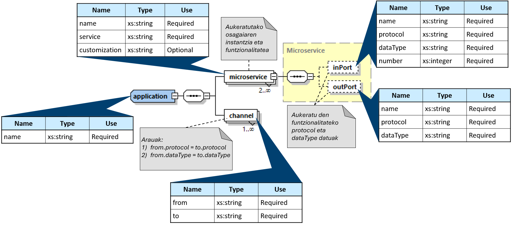
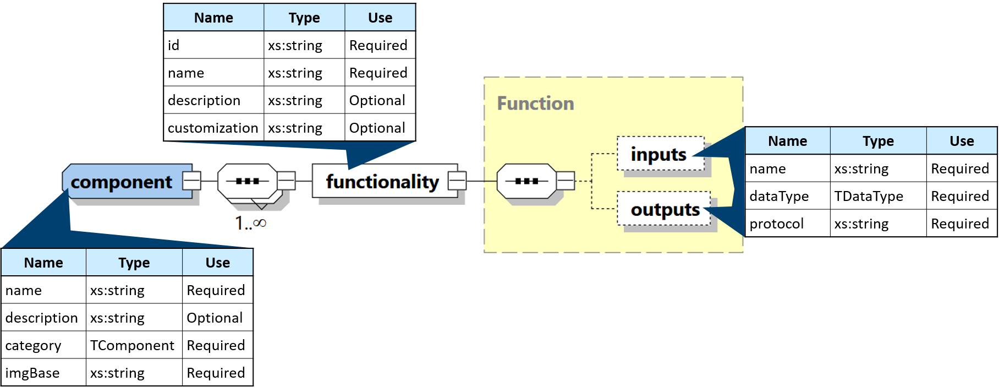

# Meta-ereduak
Karpeta honetan lan honek proposatzen dituen Fog aplikazio eta osagaientzako meta-ereduen definizioak gordetzen ditu. Meta-eredu hauek XSD teknologiarekin garatu dira, bertatik sortuko diren Fog aplikazio eta osagaien ereduak XML formatuan egongo baitira.

## Meta-ereduen irudikapen grafikoa

Hurrengo bi irudiek fitxategi hauetan zehazten diren meta-ereduak grafikoki aurkezten dira:

### Fog aplikazioen meta-ereduaren irudikapen grafikoa

### Fog osagaien meta-ereduaren irudikapen grafikoa
