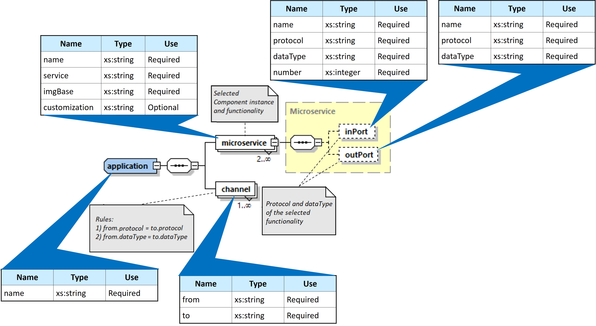
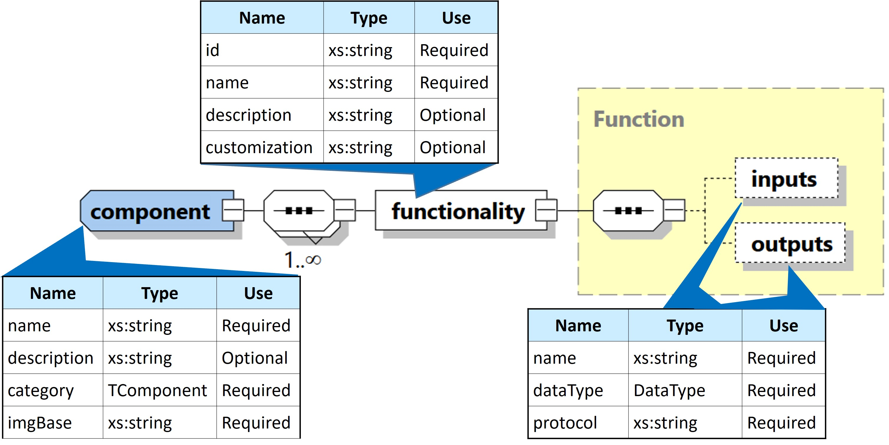

# Meta-models
This folder contains the definitions of meta-models for the applications and components proposed in this paper. These metamodels have been developed with XSD technology, since the application and component models that will be generated will be in XML format.

## Graphic representation of meta-models

The following two figures graphically depict the meta-models specified in these files:

### Application meta-model

### Component meta-model

