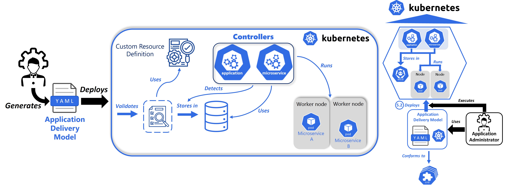

# Orchestration platform

This work proposes [Kubernetes](https://kubernetes.io/) as the container orchestration platform. This section of the repository organizes the files related to this platform and the extension that has been developed on it.

## Kubernetes extension

The Vanilla Kubernetes platform has not been used in this project. An extension has been added to the platform to implement the proposed vision. The applications and microservices levels have been integrated into the platform, which will allow the automatic delivery and operation of microservice-based application. The process of deploying an application on the proposed platform is presented as follows:

## Folder structure

This section presents the organization of the files developed for the proposed orchestration platform:

- [appModelTransformer](https://github.com/ekhurtado/EkaitzHurtado-MAL/tree/main/Kodea/Software_plataforma/appModel2CR): This folder contains all the files related to the transformation from the Application Model to Application Delivery Model. It also contains an example of these two files: `application_model.xml` and `application_delivery_model.yaml`.
  - [appModelTransformer.py](https://github.com/ekhurtado/EkaitzHurtado-MAL/blob/main/Kodea/Software_plataforma/appModel2CR/appModelTransformer.py): This program automates the mentioned transformation. In this case, from a XML file it creates a YAML file.
  - [appModelTransformer.xslt](): The necessary XSLT file to perform the M2T transformations.
- [CRD](https://github.com/ekhurtado/EkaitzHurtado-MAL/tree/main/Kodea/Software_plataforma/CRD): Application level and microservice definition files. It can be noted that the structure is the same as for the meta-models.
- [Controllers](https://github.com/ekhurtado/EkaitzHurtado-MAL/tree/main/Kodea/Software_plataforma/Kontroladoreak): Source code of the functionality of application and microservice level controllers. Three files are presented:
  - [application_controller.py](https://github.com/ekhurtado/EkaitzHurtado-MAL/blob/main/Kodea/Software_plataforma/Kontroladoreak/aplikazio_kontroladorea.py):  Application controller source code.
  - [microservice_controller.py](https://github.com/ekhurtado/EkaitzHurtado-MAL/blob/main/Kodea/Software_plataforma/Kontroladoreak/mikrozerbitzu_kontroladorea.py): Microservice controller source code.
  - [utils.py](https://github.com/ekhurtado/EkaitzHurtado-MAL/blob/main/Kodea/Software_plataforma/Kontroladoreak/utils.py): File that groups the useful methods and those shared by both controllers.
