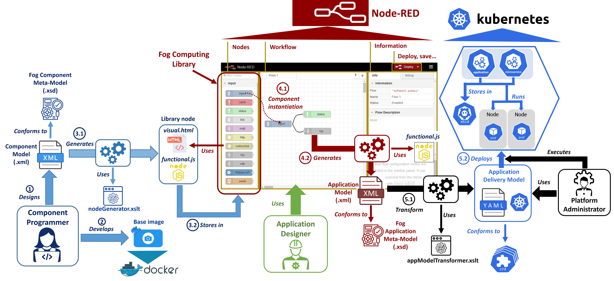

# GCIS_MDE_methodology

This repository contains the files developed in the paper "Enabling DevOps for Fog Applications in the Smart Manufacturing domain: a MDE-based Platform Engineering approach".

## Repository structure

In this section the structure of this repository will be shown. The main folders are the following:

- [NodeRED_based_platform](https://github.com/ekhurtado/GCIS_MDE_methodology/tree/main/NodeRED_based_platform): This folder includes all the files of the Node-RED-based platform that this work proposes.
- [Components](https://github.com/ekhurtado/GCIS_MDE_methodology/tree/main/Components): In this folder all the files related to the components are stored. 
- [Orchestration platform](https://github.com/ekhurtado/GCIS_MDE_methodology/tree/main/Orchestration_platform): This folder stores the resources of the container orchestration platform for the delivery and operation of microservide-based applications. The platform selected in this project has been Kubernetes.
- [Meta-models](https://github.com/ekhurtado/GCIS_MDE_methodology/tree/main/Meta_models): The meta-models proposed in this paper are presented in this folder.

It should be noted that each of them has a file _README_ with instructions and resources for using the technologies.

## Overview of the methodology

This section introduces the model-driven methodology for the design, development, delivery and operation of microservice-based applications, displaying the technologies involved:

## Contribution visual support

In order to clarify the contribution proposed in this work, a visual support has been developed, available as _Youtube_ video:

