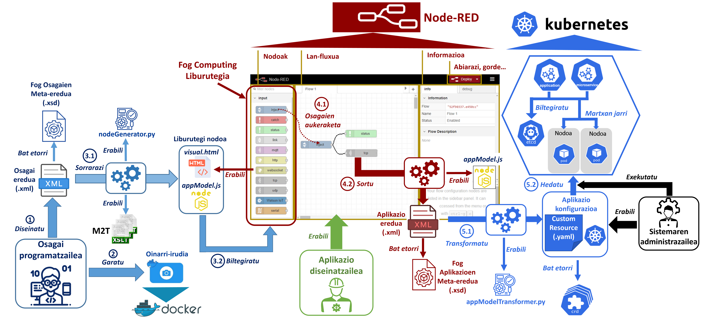

# EkaitzHurtado_MAL

Este es el repositorio para almacenar el código desarrollado para el Trabajo de Fin de Máster "Enfoque para la integración de aplicaciones OpenFog extendiendo Kubernetes" de Ekaitz Hurtado. Este trabajo se ha desarrollado en durante el máster en Ingeniería de Control, Automatización y Robótica en la Escuela de Ingeniería de Bilbao (UPV/EHU).

## A second-level heading

**README** fitxategian idazteko laguntza: [esteka](https://docs.github.com/es/get-started/writing-on-github/getting-started-with-writing-and-formatting-on-github/basic-writing-and-formatting-syntax)
Komando labur bat idazteko, adibidez, `git pull` horrela egin daiteke.

```
docker build -f Dockerfile -t ekhurtado/image:latest
```

### A third-level heading




```
docker run -f Dockerfile -t ekhurtado/nodered:latest
kubectl apply -f nire-app.yaml
```